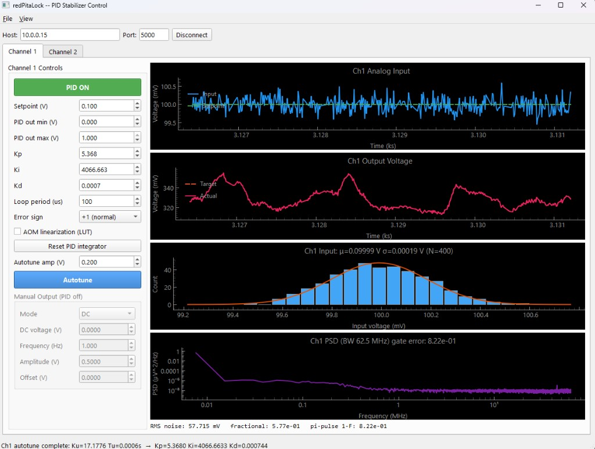
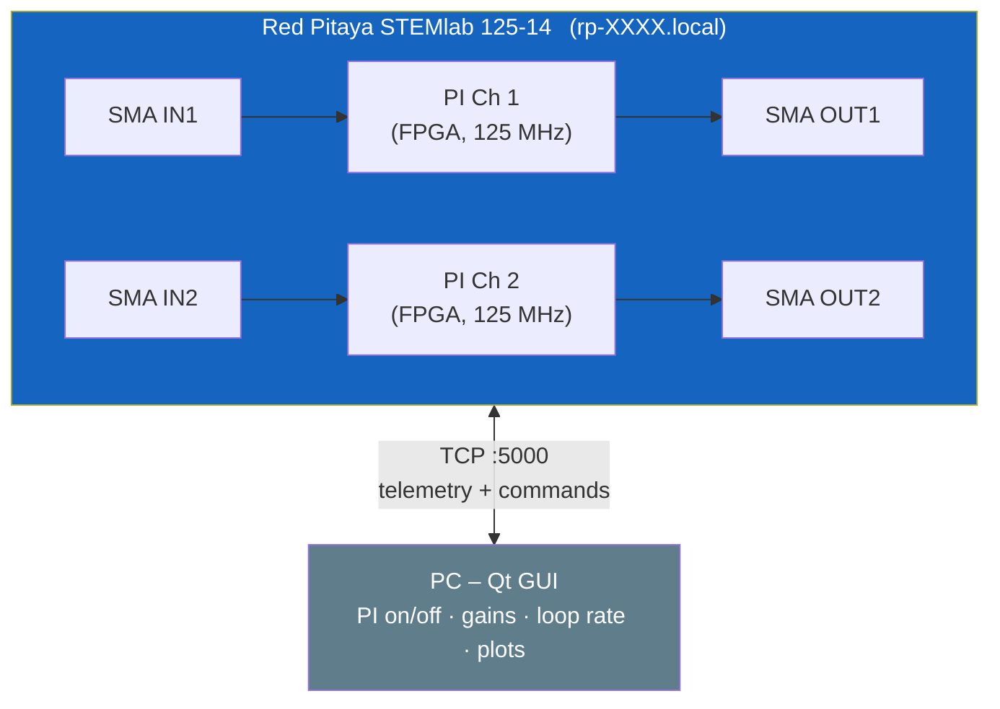
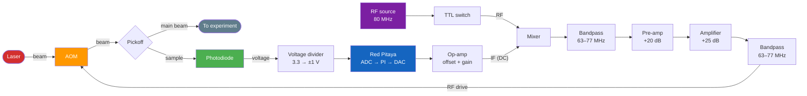

# redPitaLock

Two-channel **FPGA-resident** PI intensity stabilizer for the
**Red Pitaya STEMlab 125-14**, with a Qt-based remote control GUI.

The control loop runs in the Red Pitaya's FPGA at the full 125 MS/s ADC
rate (~8 ns latency per sample) using the stock v0.94 bitstream's
`red_pitaya_pid_block` -- driven as PI (Kd held at zero, see below).
A small C daemon on the ARM CPU acts as a *supervisor*: it pushes
user-facing setpoint and gains down to the FPGA registers, runs
telemetry and the on-chip PSD, and executes relay-feedback autotune.
The TCP protocol and Qt GUI are unchanged from the earlier 1 kHz
software-PID version (modulo the dropped `out_min` / `out_max`
controls -- see "Bounding the output voltage" below).

The system reads photodiode signals on the Red Pitaya's fast analog inputs
(IN1, IN2) and outputs corrective voltages on the fast analog outputs
(OUT1, OUT2) to stabilize laser intensity through an AOM or similar actuator.





## System diagram (per channel)



**Optical loop:** The laser passes through the AOM; a pickoff sends a sample to the photodiode. A resistive voltage divider scales the photodiode signal to the Red Pitaya's ±1 V input range. The Red Pitaya's PI loop closes the feedback by outputting a corrective voltage through an op-amp conditioning stage.

**RF drive chain:** An 80 MHz source enters a TTL switch, then a mixer whose IF port receives the Red Pitaya's DC control voltage. The mixed signal passes through a bandpass filter (63–77 MHz), a pre-amplifier (+20 dB), a power amplifier (+25 dB), a second bandpass filter, and finally drives the AOM.

## Features

- **Two independent PI channels in FPGA hardware** at 125 MS/s, ~8 ns loop latency
- Stock Red Pitaya v0.94 bitstream -- no custom Vivado build required
- Both channels **disabled by default** -- enable from the GUI
- Adjustable PI gains (Kp, Ki), setpoint, and error sign pushed live to FPGA registers
- **One-click PI autotune** using relay-feedback (Astrom-Hagglund) with Tyreus-Luyben tuning rules; the supervisor first auto-discovers the operating point by bisecting the DAC drive across the full +/- 1 V DAC envelope, so no manual setup voltage is needed
- Manual integrator-reset pulse from the GUI (`SET <ch> reset 0`) for the rare case where the loop wedges and you want to nudge it without a full disable/re-enable
- **Fast power spectral density** (PSD) from 125 MS/s ADC bulk-read with Welch averaging, showing RMS noise, fractional stability, and gate error metrics
- Real-time plots of input voltage, setpoint, input distribution, and PSD (pyqtgraph, ~100 Hz)
- Simple text-based TCP protocol (debuggable with `telnet`)

### Differences from the legacy 1 kHz software-PID build

The previous version of this firmware ran a software PID inside a Linux
RT thread at 1 kHz. Moving the loop into the FPGA changes a few things:

- **PI, not PID.** We drive the stock RP `red_pitaya_pid_block` as PI:
  the Kd register is held at zero because its DSR=10 representable
  derivative time (~64 ns) is below anything physically useful for this
  plant, so Kd is not exposed in the protocol, the GUI, or the autotune
  output.
- **No AOM linearization LUT.** The stock bitstream has no LUT in the
  PI -> DAC datapath, and at full hardware bandwidth the AOM
  nonlinearity is absorbed by the integrator. The legacy `aom_lut.c/.h`
  files have been removed.
- **No software output bracket.** The v0.94 `red_pitaya_pid_block` has no
  per-channel output min/max register, so the firmware cannot honestly
  software-bound the FPGA's instantaneous PI output to anything tighter
  than the +/- 1 V DAC envelope. The previous `out_min` / `out_max`
  controls only ever clamped the *setpoint* and the supervisor-driven
  manual / autotune paths, not the loop's transient output -- they have
  been removed rather than left as safety theatre. See "Bounding the
  output voltage" below for the honest options.
- **No input calibration (`in_scale` / `in_offset` / `out_scale` /
  `out_offset`).** The firmware now reports raw RP voltages end-to-end;
  do any unit conversion in the GUI or in your analysis scripts.
- **Output telemetry shows a gap while the PI is engaged.** The FPGA
  drives the DAC at 125 MHz; the supervisor sends NaN for the output
  field instead of pretending the slow telemetry sample is the loop's
  actual output (the GUI plots NaN as a gap thanks to
  `connect="finite"`). Use the PSD pane or an external scope to observe
  the high-rate output.
- **Software-rate manual / waveform output is now ASG-driven.** Triangle
  and sine come from the FPGA signal generator; the supervisor only
  pushes parameter changes, so frequency and amplitude are sample-
  accurate instead of being stepped at 1 kHz.
- **Input low-pass filter is removed.** The FPGA runs at the full ADC
  rate; software filtering on the input would defeat the point.
- **No user-tunable loop rate.** The control loop runs at 125 MHz in
  hardware (period 8 ns). The supervisor's wake-up cadence is a
  compile-time constant (`SUPERVISOR_PERIOD_US`, default 1 ms). The
  hardware loop rate is reported as `hw_loop_hz=125000000` in
  `GET <ch> params` and shown read-only in the GUI.
- **Gain ranges** are dictated by the FPGA fixed-point format
  (PSR=12, ISR=18). Useful ranges:
  - `kp` in V/V: roughly +/- 2.0 (max effective)
  - `ki` in 1/s: smallest non-zero step ~ 477 Hz, max ~ 3.9 MHz
  Out-of-range values are silently clamped; expect to re-tune (or just
  re-run autotune) after upgrading from the software-PID build.

## Repository Structure

```
redPitaLock/
├── firmware/
│   ├── Makefile              # Build on the Red Pitaya
│   └── src/
│       ├── main.c            # Daemon: per-channel supervisor threads + TCP server
│       ├── config.h          # Default parameters + FPGA PI register / scaling constants
│       ├── fpga_pi.c / .h    # mmap interface to the FPGA red_pitaya_pid_block at 0x40300000 (driven as PI)
│       ├── autotune.c / .h   # Relay-feedback autotune (Astrom-Hagglund)
│       ├── psd.c / psd.h     # On-chip PSD via FFT (Welch averaging)
│       ├── analog_io.c / .h  # librp fast analog I/O (telemetry, PSD, ASG output)
│       └── tcp_server.c / .h # Telemetry streaming + command parser
├── scripts/
│   ├── monitor_rp.py         # PySide6 Qt control GUI
│   └── requirements.txt      # Python dependencies
├── .gitignore
└── README.md
```

## Hardware Setup

### Voltage Ranges

The Red Pitaya fast I/O operates at **+/-1 V** (LV jumper setting), which
differs from the original 0-3.3 V Pico setup. External signal conditioning
is required:

| Signal | Pico Range | RP Fast I/O Range | Recommended Conditioning |
|--------|-----------|-------------------|--------------------------|
| Photodiode input | 0-3.3 V | +/-1 V (LV) | 3.3:1 resistive voltage divider |
| AOM drive output | 0.18-1.25 V | +/-1 V | Op-amp offset + gain stage |

All voltages reported by the daemon are raw Red Pitaya volts. Apply any
unit conversion (e.g. photodiode V -> optical power, or V -> AOM drive
amplitude) in the GUI or in your analysis scripts.

### Connections

| Red Pitaya Port | Signal |
|-----------------|--------|
| SMA IN1 | Photodiode channel 1 (through voltage divider) |
| SMA OUT1 | AOM drive channel 1 (through conditioning circuit) |
| SMA IN2 | Photodiode channel 2 (through voltage divider) |
| SMA OUT2 | AOM drive channel 2 (through conditioning circuit) |
| Ethernet | Network connection to PC |

## Building the Firmware

The firmware is compiled **on the Red Pitaya** itself (ARM Linux with `gcc`
and `librp` pre-installed).

```bash
# From your PC -- copy the source to the Red Pitaya
scp -r firmware/ root@rp-XXXX.local:/root/redPitaLock/

# SSH into the Red Pitaya (default password: root)
ssh root@rp-XXXX.local

# Build
cd /root/redPitaLock/firmware
make

# Run (requires root for real-time thread priority)
./stabilizer_rp
```

If the Red Pitaya web apps are running and conflict with the FPGA
acquisition/generation, stop them first:

```bash
systemctl stop redpitaya_nginx
```

### Verifying the FPGA PI block is reachable

The daemon mmaps the PI register region (the stock RP `red_pitaya_pid_block`)
at boot and runs a 14-bit loopback against PID11's setpoint register. If
the v0.94 bitstream is not loaded (or a different image is active that
lacks the PID block), startup will fail with:

```
fpga_pi_open: PI register loopback failed (wrote 0x1a5, read 0x???). Is the v0.94 bitstream loaded?
```

Force-load v0.94 if needed (your Red Pitaya OS may use a slightly
different command name):

```bash
cat /opt/redpitaya/fpga/v0.94/fpga.bit > /dev/xdevcfg
# or, on newer images:
overlay.sh v0.94
```

### Validation after first boot

1. **Smoke test (no laser):** with both channels disabled, set `out_mode 0` and
   `manual_v 0.0`, confirm DAC reads 0 V.
2. **Open-loop gain check:** enable PI with `kp=0.1, ki=0`, drive a known
   DC voltage into IN1, observe OUT1 follows `kp * (setpoint - input)`
   instantaneously. The FPGA loop is too fast to see the response on the
   GUI traces; use an external scope.
3. **Closed-loop step test:** with the photodiode connected and a real
   AOM, run autotune. Compare the achieved noise floor against the legacy
   software-PID build using the PSD pane: integrated noise should drop
   significantly above the old loop-bandwidth corner (~ a few hundred Hz)
   because the FPGA loop covers a much wider band.
### Bounding the output voltage

The stock v0.94 `red_pitaya_pid_block` has no per-channel output min /
max register. The firmware therefore does not (and cannot honestly)
software-bound the FPGA's instantaneous PI output to anything tighter
than the +/- 1 V DAC envelope -- between two supervisor ticks the
hardware loop can swing the DAC anywhere in that range, regardless of
what the C side is doing.

If your AOM driver (or any other downstream load) requires a tighter
window, add an external clamp on each OUT line. Two simple options:

- A pair of Schottky diodes from OUT to a clean reference rail (one
  to `+V_clamp`, one to `-V_clamp`).
- An op-amp limiter (e.g. precision rectifier or back-to-back zeners
  in the feedback path).

A hardware clamp protects the load against daemon crashes, kernel
oopses, and firmware bugs alike -- a software bound never can.

### Running as a Service

To start automatically on boot:

```bash
cat > /etc/systemd/system/stabilizer.service << 'EOF'
[Unit]
Description=redPitaLock PI Stabilizer
After=network.target

[Service]
ExecStart=/root/redPitaLock/firmware/stabilizer_rp
Restart=on-failure
Nice=-20

[Install]
WantedBy=multi-user.target
EOF

systemctl enable stabilizer
systemctl start stabilizer
```

## Running the GUI

On your PC:

```bash
cd scripts/
pip install -r requirements.txt
python monitor_rp.py                    # default: rp-XXXX.local:5000
python monitor_rp.py 192.168.1.100     # explicit IP
python monitor_rp.py rp-XXXX.local 5000  # explicit host + port
```

### GUI Controls (per channel)

| Control | Description |
|---------|-------------|
| **PI ON/OFF** | Toggle PI feedback (off by default) |
| **Setpoint (V)** | Target photodiode voltage |
| **Kp** | Proportional gain (V/V; |Kp| <= ~2.0) |
| **Ki (Hz)** | Integral gain (1/s; quantum ~ 477 Hz, max ~ 3.9 MHz) |
| **Hardware loop** | Read-only indicator of the FPGA loop rate (125 MHz / 8 ns) |
| **Error sign** | +1 (normal) or -1 (inverted feedback) |
| **Reset PI integrator** | Pulse the FPGA integrator-reset bit |
| **Autotune amp (V)** | Relay half-amplitude for autotune excitation |
| **Autotune** | Start/cancel relay-feedback autotune; shows live progress. Refuses (with status-bar message) if PI is OFF |

## TCP Protocol

The daemon listens on port 5000. Connect with `telnet rp-XXXX.local 5000`
to debug.

### Telemetry (server -> client, ~100 Hz)

```
D <ch> <time_s> <input_V> <output_V> <setpoint_V> <enabled>
AT <ch> <crossings> <measured_cycles> <elapsed_s>    # while autotune is running
A <ch> <Ku> <Tu> <Kp> <Ki>                            # autotune completed
AF <ch>                                               # autotune failed (timeout)
PSD <ch> <n_bins> <fs>                                # header: the next line is bins
<bin0> <bin1> ... <bin_n_bins-1>                      # space-separated PSD bins
```

`output_V` is the supervisor's view of the DAC drive: the manual / waveform
voltage when the PI is OFF, and `nan` while the FPGA owns the loop (use
the PSD pane or an external scope for the true high-rate output).

Example:
```
D 0 1.234567 0.4832 nan 0.5000 1
D 1 1.234568 0.3210 0.0000 0.5000 0
AT 0 4 1 2.3
A 0 12.3456 0.0234 5.5555 284.3210
```

### Commands (client -> server)

```
SET <ch> enabled 1              # enable PI
SET <ch> enabled 0              # disable PI
SET <ch> setpoint 0.500         # photodiode target voltage (V)
SET <ch> kp 0.5                 # proportional gain  (V/V; |Kp| <= ~2.0)
SET <ch> ki 1000.0              # integral gain      (1/s; step ~ 477 Hz, max ~ 3.9 MHz)
SET <ch> error_sign 1.0         # feedback polarity (+1 or -1)
SET <ch> reset 0                # reset PI integrator
SET <ch> autotune 1             # start auto-bias + relay-feedback autotune
SET <ch> autotune 0             # cancel autotune
SET <ch> autotune_amp 0.5       # relay half-amplitude (V) for next autotune
SET <ch> autotune_hyst 0.005    # noise band around setpoint (V)
SET <ch> out_mode 0             # 0=DC, 1=triangle, 2=sine (PI OFF only)
SET <ch> manual_v 0.0           # DC voltage when out_mode == 0
SET <ch> wave_freq 1.0          # waveform frequency (Hz)
SET <ch> wave_amp 0.5           # waveform peak amplitude (V)
SET <ch> wave_offset 0.0        # waveform DC offset (V)
SET <ch> psd_avg 8              # Welch segments to average
SET <ch> psd_interval 1000      # ms between PSD updates
GET <ch> params                 # query all parameters
```

## PI Algorithm

The PI is the stock Red Pitaya `red_pitaya_pid_block` running in the
v0.94 FPGA bitstream, driven as PI (Kd register held at zero).
For each ADC sample (every 8 ns):

- **P term:** `Kp_reg * error >> 12`
- **I term:** integrator accumulator increments by `Ki_reg * error >> 18`
  per sample, with hardware saturation
- **D term:** the block has one, but its register is held at zero (see below)
- **Output** is the sum of P + I, clamped at the +/- 1 V DAC range

The supervisor on the ARM CPU translates user-facing units into the
14-bit fixed-point registers as:

| User unit | Register formula | Effective range |
|-----------|------------------|-----------------|
| `kp` (V/V) | `Kp_reg = round(kp * 4096)` | `+/- 2.0` |
| `ki` (1/s) | `Ki_reg = round(ki * 2^18 / 125e6)` | `~ 477 Hz to 3.9e6 Hz` |
| `setpoint` (V) | `SP_reg = round(setpoint * 8192)` | `+/- 1 V` |

We run the stock RP `red_pitaya_pid_block` as PI: the Kd register is
held at zero because its DSR=10 representable derivative time (~64 ns)
is below anything physically useful here, so Kd is not exposed.

Polarity (`error_sign`) is folded into the gain signs because the stock
block does not have an explicit polarity register. The v0.94 PID block
already saturates its integrator in hardware, so there is no software
anti-windup; if the loop wedges, pulse the FPGA integrator-reset bit
manually with `SET <ch> reset 0` (the GUI exposes this as "Reset PI
integrator").

## Autotune

The autotune uses the **Astrom-Hagglund relay-feedback** method, with a
one-shot bisection up front so the user does not have to dial in an
operating-point voltage manually:

1. Enable PI and set a valid setpoint.
2. Click **Autotune**. If PI is OFF, autotune is refused with a
   status-bar message and an entry in `/tmp/stabilizer_rp.log`.
3. **Auto-bias phase.** The supervisor takes the FPGA PI out of the
   loop and bisects the DAC drive across the full `[-1 V, +1 V]` DAC
   envelope (`AUTOTUNE_BIAS_LO` / `AUTOTUNE_BIAS_HI`), waiting ~50 ms
   per step for the plant to settle, until the input is within
   `AUTOTUNE_BIAS_TOL_V` of the setpoint or 8 bisection steps have run.
   The accepted drive becomes the relay center.
4. **Relay phase.** A bang-bang relay swings between `center + amp` and
   `center - amp`. After discarding 1 settle cycle the firmware measures
   the oscillation period (Tu) and peak-to-peak amplitude (`peak_hi -
   peak_lo`, tracked unconditionally over each cycle so plant phase lag
   doesn't bias the amplitude estimate) over 3 full cycles.
5. Ultimate gain and PI gains are computed using **Tyreus-Luyben** rules
   (`a = peak-to-peak / 2` is the single-sided sinusoidal amplitude
   Astrom-Hagglund expects):
   - `Ku = 4d / (pi * a)` where `d` = relay half-amplitude
   - `Kp = Ku / 3.2`, `Ki = Ku / (7.04 * Tu)`  (no Kd; see above)
6. The supervisor writes the gains into `s->kp` / `s->ki`; the next
   supervisor tick (~1 ms later) pushes them into the FPGA registers,
   re-engaging the closed-loop PI. A `[autotune] applied ch<N>: kp=...
   ki=...` line is logged.
7. The GUI spinboxes update automatically with the computed gains.

The autotune respects `error_sign` so it works with both normal and inverted
plant polarity. A 30-second timeout aborts if no oscillation is detected.

## Origin

Ported from [stabilizerPi](https://github.com/beneaze/stabilizerPi), a
Raspberry Pi Pico-based single-channel laser intensity stabilizer.
