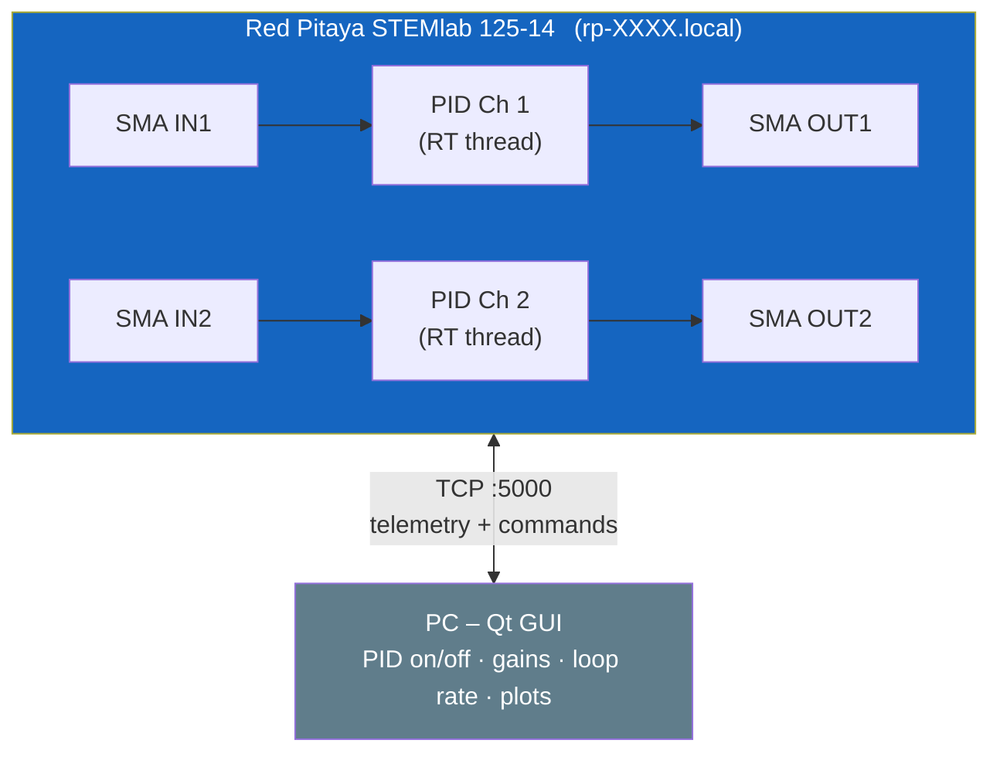

# redPitaLock

Two-channel PID intensity stabilizer for the **Red Pitaya STEMlab 125-14**,
with a Qt-based remote control GUI.

The system reads photodiode signals on the Red Pitaya's fast analog inputs
(IN1, IN2) and outputs corrective voltages on the fast analog outputs
(OUT1, OUT2) to stabilize laser intensity through an AOM or similar actuator.




## System diagram (per channel)


**Optical loop:** The laser passes through the AOM; a pickoff sends a sample to the photodiode. A resistive voltage divider scales the photodiode signal to the Red Pitaya's ±1 V input range. The Red Pitaya's PID loop closes the feedback by outputting a corrective voltage through an op-amp conditioning stage.

**RF drive chain:** An 80 MHz source enters a TTL switch, then a mixer whose IF port receives the Red Pitaya's DC control voltage. The mixed signal passes through a bandpass filter (63–77 MHz), a pre-amplifier (+20 dB), a power amplifier (+25 dB), a second bandpass filter, and finally drives the AOM.

## Features

- **Two independent PID channels** using 14-bit, 125 MS/s fast analog I/O
- Both channels **disabled by default** -- enable from the GUI
- Adjustable PID gains (Kp, Ki, Kd), setpoint, loop rate, and error sign
- **One-click PID autotune** using relay-feedback (Astrom-Hagglund) with Tyreus-Luyben tuning rules
- Derivative on measurement (not error) to avoid noise amplification
- First-order low-pass filter on ADC input before PID
- Optional AOM linearization lookup table per channel
- Configurable PID output limits (out_min / out_max)
- Anti-windup integral clamping
- **Fast power spectral density** (PSD) from 125 MS/s ADC bulk-read with Welch averaging, showing RMS noise, fractional stability, and gate error metrics
- Real-time plots of input voltage, target output, actual output, input distribution, and PSD (pyqtgraph, ~100 Hz)
- Simple text-based TCP protocol (debuggable with `telnet`)

## Repository Structure

```
redPitaLock/
├── firmware/
│   ├── Makefile              # Build on the Red Pitaya
│   └── src/
│       ├── main.c            # Daemon: two RT PID threads + TCP server
│       ├── config.h          # Default parameters (gains, rates, scaling)
│       ├── pid.c / pid.h     # PID algorithm with anti-windup
│       ├── autotune.c / .h   # Relay-feedback autotune (Astrom-Hagglund)
│       ├── psd.c / psd.h     # On-chip PSD via FFT (Welch averaging)
│       ├── aom_lut.c / .h    # AOM drive linearization lookup table
│       ├── analog_io.c / .h  # librp fast analog I/O abstraction
│       └── tcp_server.c / .h # Telemetry streaming + command parser
├── scripts/
│   ├── monitor_rp.py         # PySide6 Qt control GUI
│   └── requirements.txt      # Python dependencies
├── .gitignore
└── README.md
```

## Hardware Setup

### Voltage Ranges

The Red Pitaya fast I/O operates at **+/-1 V** (LV jumper setting), which
differs from the original 0-3.3 V Pico setup. External signal conditioning
is required:

| Signal | Pico Range | RP Fast I/O Range | Recommended Conditioning |
|--------|-----------|-------------------|--------------------------|
| Photodiode input | 0-3.3 V | +/-1 V (LV) | 3.3:1 resistive voltage divider |
| AOM drive output | 0.18-1.25 V | +/-1 V | Op-amp offset + gain stage |

The firmware has per-channel `input_scale`, `input_offset`, `output_scale`,
and `output_offset` parameters adjustable at runtime via the GUI or TCP
commands.

### Connections

| Red Pitaya Port | Signal |
|-----------------|--------|
| SMA IN1 | Photodiode channel 1 (through voltage divider) |
| SMA OUT1 | AOM drive channel 1 (through conditioning circuit) |
| SMA IN2 | Photodiode channel 2 (through voltage divider) |
| SMA OUT2 | AOM drive channel 2 (through conditioning circuit) |
| Ethernet | Network connection to PC |

## Building the Firmware

The firmware is compiled **on the Red Pitaya** itself (ARM Linux with `gcc`
and `librp` pre-installed).

```bash
# From your PC -- copy the source to the Red Pitaya
scp -r firmware/ root@rp-XXXX.local:/root/redPitaLock/

# SSH into the Red Pitaya (default password: root)
ssh root@rp-XXXX.local

# Build
cd /root/redPitaLock/firmware
make

# Run (requires root for real-time thread priority)
./stabilizer_rp
```

If the Red Pitaya web apps are running and conflict with the FPGA
acquisition/generation, stop them first:

```bash
systemctl stop redpitaya_nginx
```

### Running as a Service

To start automatically on boot:

```bash
cat > /etc/systemd/system/stabilizer.service << 'EOF'
[Unit]
Description=redPitaLock PID Stabilizer
After=network.target

[Service]
ExecStart=/root/redPitaLock/firmware/stabilizer_rp
Restart=on-failure
Nice=-20

[Install]
WantedBy=multi-user.target
EOF

systemctl enable stabilizer
systemctl start stabilizer
```

## Running the GUI

On your PC:

```bash
cd scripts/
pip install -r requirements.txt
python monitor_rp.py                    # default: rp-XXXX.local:5000
python monitor_rp.py 192.168.1.100     # explicit IP
python monitor_rp.py rp-XXXX.local 5000  # explicit host + port
```

### GUI Controls (per channel)

| Control | Description |
|---------|-------------|
| **PID ON/OFF** | Toggle PID feedback (off by default) |
| **Setpoint (V)** | Target photodiode voltage |
| **Kp, Ki, Kd** | PID gains |
| **Loop period (us)** | Control loop update interval |
| **Error sign** | +1 (normal) or -1 (inverted feedback) |
| **AOM linearization** | Enable/disable the AOM drive lookup table |
| **PID out min / max (V)** | Output clamp range for the PID controller |
| **Reset PID integrator** | Zero the integral accumulator |
| **Autotune amp (V)** | Relay half-amplitude for autotune excitation |
| **Autotune** | Start/cancel relay-feedback autotune; shows live progress |

## TCP Protocol

The daemon listens on port 5000. Connect with `telnet rp-XXXX.local 5000`
to debug.

### Telemetry (server -> client, ~100 Hz)

```
D <ch> <input_V> <target_out_V> <actual_out_V> <setpoint_V> <enabled>
AT <ch> <crossings> <measured_cycles> <elapsed_s>    # while autotune is running
A <ch> <Ku> <Tu> <Kp> <Ki> <Kd>                       # autotune completed
AF <ch>                                               # autotune failed (timeout)
```

Example:
```
D 0 0.4832 0.7521 0.7521 0.5000 1
D 1 0.3210 0.0000 0.0000 0.5000 0
AT 0 4 1 2.3
A 0 12.3456 0.0234 5.5555 284.3210 0.000744
```

### Commands (client -> server)

```
SET <ch> enabled 1              # enable PID
SET <ch> enabled 0              # disable PID
SET <ch> setpoint 1.500         # set target voltage
SET <ch> kp 4.0                 # proportional gain
SET <ch> ki 2.0                 # integral gain
SET <ch> kd 0.04                # derivative gain
SET <ch> loop_rate 1000         # loop period in microseconds
SET <ch> error_sign 1.0         # feedback polarity (+1 or -1)
SET <ch> use_lut 1              # enable AOM linearization
SET <ch> in_scale 3.3           # input calibration scale
SET <ch> in_offset 0.0          # input calibration offset
SET <ch> out_scale 1.0          # output calibration scale
SET <ch> out_offset 0.0         # output calibration offset
SET <ch> out_min 0.0            # minimum PID output (V)
SET <ch> out_max 1.0            # maximum PID output (V)
SET <ch> reset 0                # reset PID integrator
SET <ch> autotune 1             # start relay-feedback autotune
SET <ch> autotune 0             # cancel autotune
SET <ch> autotune_amp 0.5       # relay half-amplitude (V)
SET <ch> autotune_hyst 0.005    # hysteresis band (V)
GET <ch> params                 # query all parameters
```

## PID Algorithm

- **P term:** `Kp * error`
- **I term:** `Ki * integral`, with clamping to `+/-integral_max` and
  anti-windup (integral freezes when output saturates in the same direction
  as the error)
- **D term:** `Kd * d(measurement)/dt` (derivative on measurement, not error,
  to avoid kick on setpoint changes and reduce noise amplification)
- **Input filter:** first-order IIR low-pass on ADC before PID (`INPUT_LPF_ALPHA`)
- **Output** clamped to `[out_min, out_max]` (default 0-1 V)

When the AOM LUT is enabled, the normalized 0-1 PID output is mapped through
a 13-point piecewise-linear curve to the physical AOM drive voltage
(~0.18-1.25 V).

## Autotune

The autotune uses the **Astrom-Hagglund relay-feedback** method:

1. Enable PID and set a valid setpoint
2. Click **Autotune** -- the PID is temporarily replaced by a bang-bang relay
3. The relay forces the output to oscillate around the setpoint, swinging
   between `center + amp` and `center - amp` (center = current output voltage)
4. After discarding 1 settle cycle, the firmware measures the oscillation
   period (Tu) and peak-to-peak amplitude (a) over 3 full cycles
5. Ultimate gain and PID gains are computed using **Tyreus-Luyben** rules:
   - `Ku = 4d / (pi * a)` where d = relay amplitude
   - `Kp = Ku / 3.2`, `Ki = Ku / (7.04 * Tu)`, `Kd = Ku * Tu / 13.86`
6. Gains are written into the PID and normal control resumes
7. The GUI spinboxes update automatically with the computed gains

The autotune respects `error_sign` so it works with both normal and inverted
plant polarity. A 30-second timeout aborts if no oscillation is detected.

## Origin

Ported from [stabilizerPi](https://github.com/beneaze/stabilizerPi), a
Raspberry Pi Pico-based single-channel laser intensity stabilizer.
